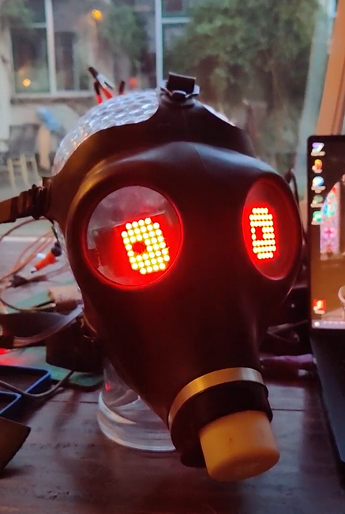

#  MD_MAX72xx Eyes gas mask
Two MAX7219 matrix displays can uncreep a gas mask with a couple of cute animated eyes.   
Many thanks to the [MD_MAX72xx](https://github.com/MajicDesigns/MD_MAX72XX) library for providing this delightful source code example.

See him animated here https://photos.app.goo.gl/me1r3ZCts2rHHRsc9